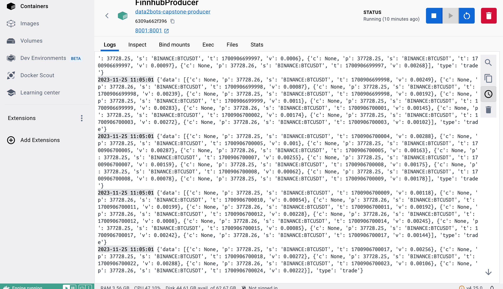
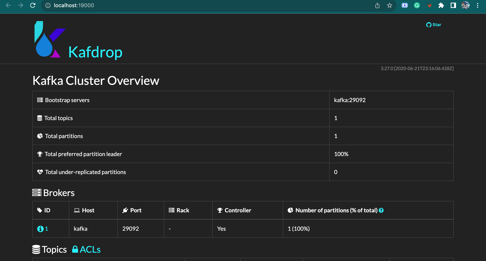
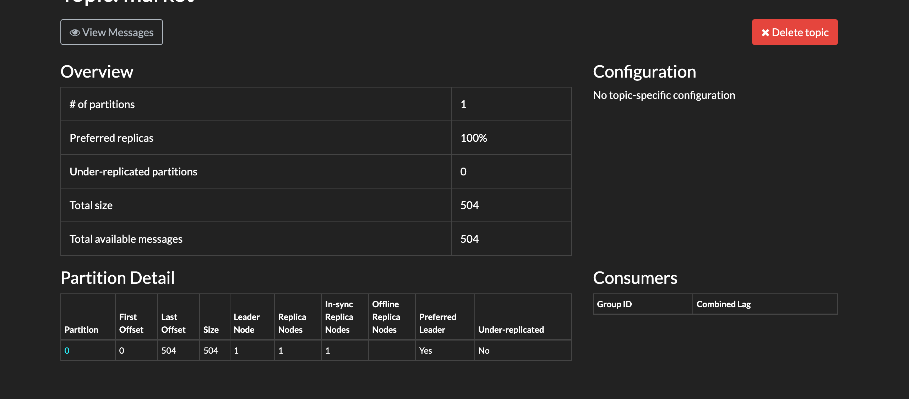
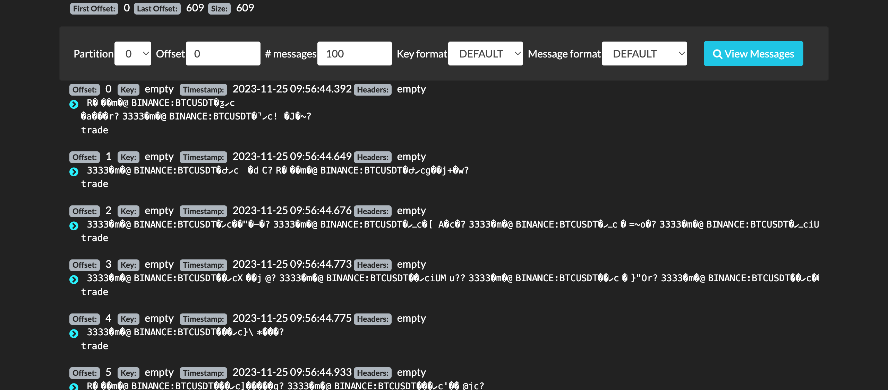
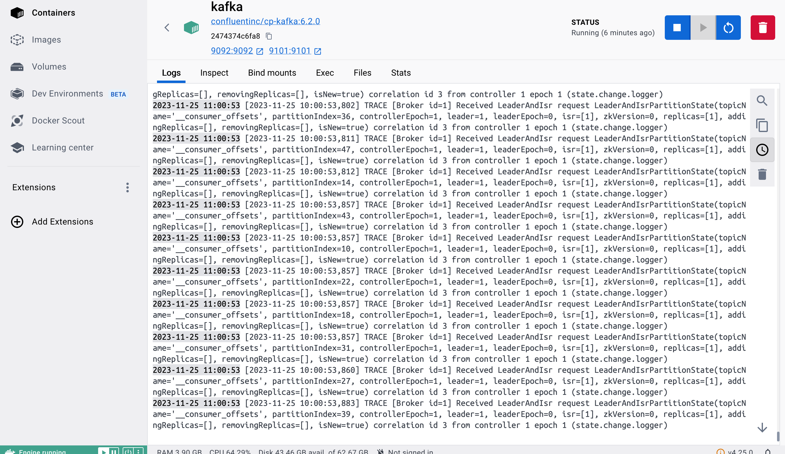
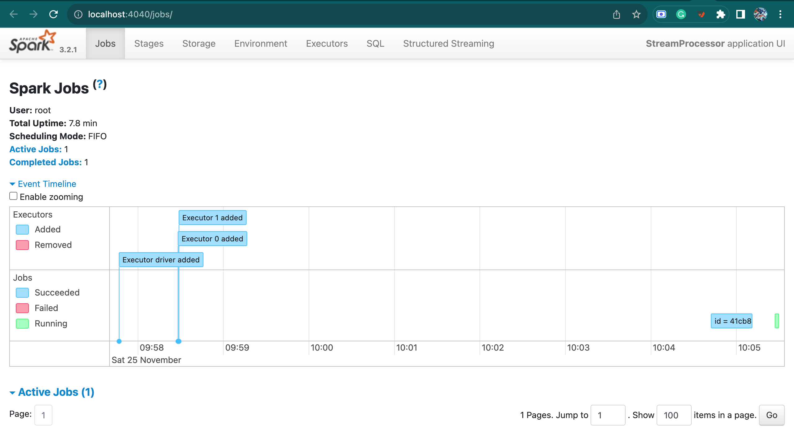
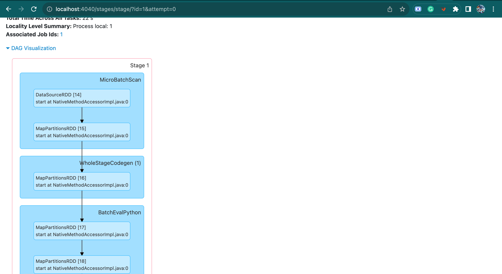
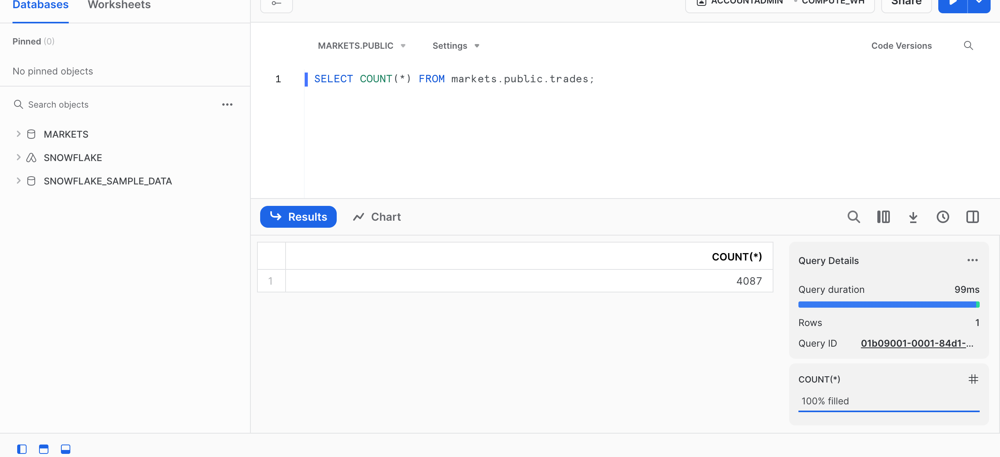
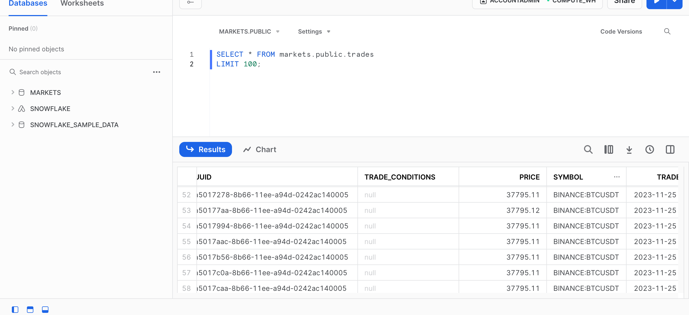

# Finnhub Streaming Data Pipeline


## Architecture


## 1. Data Sources
In a streaming data engineering project, data sources are central to providing continuous real-time data that drives the system. Finnhub stands out as a valuable source of financial and market data. Here's why Finnhub is a top choice:

I. **Real-Time Data**: Finnhub offers real-time data feeds for various financial instruments, including stocks, market indices, and currency exchange rates, enabling timely decision-making and trend tracking.

II. **Streaming Expertise**: Through WebSockets, Finnhub provides real-time data updates, a major asset for applications requiring instant market insights.

III. **Comprehensive Data**: Finnhub covers diverse market aspects, such as stock quotes, company financials, news sentiment, and insider trading data, offering a holistic financial view.

IV. **Data Integrity**: Renowned for its data quality and precision, Finnhub ensures reliability, a critical aspect in financial data engineering.

V. **Ease of Integration**: Finnhub's APIs and SDKs simplify integration into data pipelines, making data readily accessible for tailored use.

VI. **Customization**: Users can tailor the data they receive to match specific needs, ensuring relevance.

VII. **Regulatory Compliance**: For financial projects, Finnhub delivers data with proper licensing and permissions, ensuring regulatory adherence.

VIII. **Scalability**: Finnhub accommodates projects of all sizes, from small-scale trading apps to large financial institutions, through scalable data streams.

IX. **Historical Data**: In addition to real-time data, Finnhub offers historical data for trend analysis and backtesting trading strategies.

Leveraging Finnhub as a data source in streaming data engineering projects empowers professionals to utilize real-time financial data for informed decision-making, algorithm development, and market insights. By tapping into Finnhub's vast data offerings and real-time capabilities, organizations gain an advantage in monitoring trends, seizing opportunities, and managing risks in the ever-evolving financial landscape.

## 2. Data Ingestion
Data ingestion from Finnhub can be streamlined and made scalable by setting up the Finnhub Producer application and containerizing the solution.
The Finnhub Producer is an app to fetch market data from Finnhub's API. Containerizing this application ensures easy deployment, scalability, and consistent execution across various environments.
#### Add finnhub key
Open the .env file within the directory and replace the placeholder `"Your Finnhub token"` with your actual Finnhub API key.



The Producer service subscribes to the stock ticker trading topic through the Finnhub WebSocket endpoint. Leveraging the power of websockets and the kafka-python library, the producer app reads messages in near real-time from the web socket, encoding each JSON response into Avro binary format.


Every encoded message is then dispatched to the Kafka broker, which we've configured in the preceding Docker Compose file. In this architecture, Kafka acts as a reliable message bus. Our primary focus is on transmitting these crucial ticker data points to a designated Kafka topic. This strategy facilitates asynchronous consumption, providing the groundwork for a separate Spark processing cluster. By utilizing Kafka as a dedicated message broker, we create a seamless flow for sending and receiving financial market data, optimizing the architecture for subsequent Spark-driven analytics and processing.

## 3. Kafka





## 4. Spark



## 5.Snowflake
The database definition is given by the query below, and can be found at this directory `snowflake/snowflake-setup.sql`:

```sql
-- Create a database if it does not exist and switch to it
CREATE DATABASE IF NOT EXISTS markets;

-- Switch to the market database
USE DATABASE markets;

-- Create a table 'trades'
CREATE TABLE IF NOT EXISTS trades (
    uuid STRING,
    trade_conditions STRING,
    price DOUBLE,
    symbol STRING,
    trade_timestamp TIMESTAMP,
    ingest_timestamp TIMESTAMP,
    volume DOUBLE,
    type STRING,
    PRIMARY KEY (symbol, trade_timestamp)
);

```



## To run the code:
    - Copy the snowflake-setup.sql content and paste in your snowflake GUI and run the query
    - Clone this repository
    - Run `make` on your terminal to start the streaming process
    - run `docker-compose down` to kill all processes

## Improvements
1. Use Terraform for IAAC - this including starting the container as well as creating the database.
2. Add some transformation queries to the spark to perform some business requirements.
